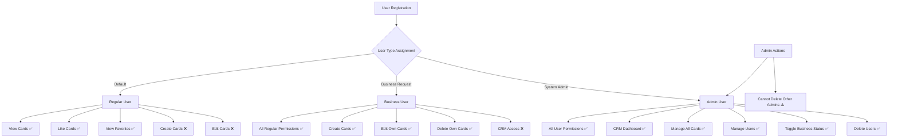

# 🎴 Business Cards Web Application

<div align="center">


_A modern, full-featured business cards management platform built with React & TypeScript_

[](https://reactjs.org/) [](https://www.typescriptlang.org/) [](https://vitejs.dev/) [](https://tailwindcss.com/)

• [📖 Documentation](#-documentation) • [🚀 Quick Start](#-quick-start) • [✨ Features](#-key-features) • [📁 Project Structure](#-project-structure) <br/>
• [🌐 Online Project Website On Render](https://gal-ben-abu-s-hackeru-reactmoduleproject-lebx.onrender.com)
</div>

---

## 📋 Table of Contents

- [🎯 Project Overview](#-project-overview)
- [✨ Key Features](#-key-features)
- [👥 User Roles & Permissions](#-user-roles--permissions)
- [🚀 Quick Start](#-quick-start)
- [📁 Project Structure](#-project-structure)
- [📖 Documentation](#-documentation)
- [🔗 API Integration](#-api-integration)
- [🧪 Testing](#-testing)
- [🚢 Deployment](#-deployment)
- [📝 Changelog](#-changelog)
- [📋 Todo List](#-todo-list)
- [📄 License](#-license)

---

## 🎯 Project Overview

The **Business Cards Web Application** is a comprehensive platform for managing digital business cards with advanced user authentication, role-based permissions, and full CRUD operations. Built with modern web technologies, it provides a seamless experience for both regular users and administrators.

### 🌟 What Makes This Special?

- **🔐 Advanced Authentication**: Secure login/signup with JWT tokens
- **👑 Role-Based Access Control**: Different permissions for users and admins
- **📱 Responsive Design**: Works perfectly on all devices
- **⚡ Real-time Operations**: Instant updates with REST API integration
- **🎨 Modern UI/UX**: Clean, intuitive interface with dark mode support
- **🔄 State Management**: Efficient Redux Toolkit implementation

---

## ✨ Key Features

<table>
<tr>
<td width="50%">

### 👤 **User Features**

- 🏠 **Home Page**: Browse all available business cards
- 🔍 **Search & Filter**: Find cards quickly with advanced search
- ❤️ **Favorites**: Save and manage favorite cards
- 📝 **Card Management**: Create, edit, and delete personal cards
- 👤 **Profile Management**: Update personal information
- 🌙 **Dark Mode**: Toggle between light and dark themes

</td>
<td width="50%">

### 👑 **Admin Features**

- 🏢 **CRM Dashboard**: Comprehensive user and card management
- 👥 **User Management**: View, edit, and remove users
- 🎴 **Card Oversight**: Manage all cards across the platform
- 🔧 **Permission Control**: Toggle business permissions
- 📊 **Analytics**: View platform statistics and insights
- 🔒 **System Security**: Advanced admin-only operations

</td>
</tr>
</table>

### 🎯 **Core Functionalities**

| Feature            | Description                    | User Access | Admin Access |
| ------------------ | ------------------------------ | ----------- | ------------ |
| View Cards         | Browse all business cards      | ✅          | ✅           |
| Card Details       | View detailed card information | ✅          | ✅           |
| Create Cards       | Add new business cards         | ✅          | ✅           |
| Edit Cards         | Modify own cards               | ✅ (Own)    | ✅ (All)     |
| Delete Cards       | Remove cards                   | ✅ (Own)    | ✅ (All)     |
| Like/Unlike        | Favorite management            | ✅          | ✅           |
| User Management    | Manage platform users          | ❌          | ✅           |
| Permission Control | Toggle business permissions    | ❌          | ✅           |

---

## 🏛️ Technical Architecture

### 🛠️ **Tech Stack**

<div align="center">

| Category               | Technologies                       |
| ---------------------- | ---------------------------------- |
| **Frontend**           | React 18+, TypeScript, Vite        |
| **Styling**            | Tailwind CSS, Custom CSS Modules   |
| **State Management**   | Redux Toolkit                      |
| **Routing**            | React Router DOM                   |
| **Forms & Validation** | Joi Validation                     |
| **Build Tools**        | Vite, ESLint, Prettier             |
| **Development**        | Hot Reload, TypeScript Strict Mode |

</div>

### 🏗️ **Architecture Patterns**

- **🔄 Flux Architecture**: Unidirectional data flow with Redux
- **🧩 Component-Based**: Reusable, modular React components
- **🛡️ Type Safety**: Full TypeScript implementation
- **🎭 Custom Hooks**: Reusable logic with React hooks
- **🛣️ Protected Routes**: Route-based authentication
- **📦 Code Splitting**: Lazy loading for optimal performance

---

## 👥 User Roles & Permissions

<div align="center">



</div>

### 🔐 **Permission Matrix**

| Action           | Guest | Regular User | Business User | Admin |
| ---------------- | ----- | ------------ | ------------- | ----- |
| View Cards       | ✅    | ✅           | ✅            | ✅    |
| Register/Login   | ✅    | ✅           | ✅            | ✅    |
| Create Cards     | ❌    | ❌           | ✅            | ✅    |
| Edit Own Cards   | ❌    | ❌           | ✅            | ✅    |
| Delete Own Cards | ❌    | ❌           | ✅            | ✅    |
| Like Cards       | ❌    | ✅           | ✅            | ✅    |
| View Favorites   | ❌    | ✅           | ✅            | ✅    |
| CRM Access       | ❌    | ❌           | ❌            | ✅    |
| Manage All Cards | ❌    | ❌           | ❌            | ✅    |
| Manage Users     | ❌    | ❌           | ❌            | ✅    |
| Delete Users     | ❌    | ❌           | ❌            | ✅    |

---

## 🚀 Quick Start

### 📋 **Prerequisites**

```bash
Node.js >= 18.0.0
npm >= 8.0.0
```

### ⚡ **Installation**

```bash
# Clone the repository
git clone <your-repo-url>
cd business-cards-app

# Install dependencies
npm install

# Start development server
npm run dev
```

### 🌐 **Environment Setup**

Create a `.env` file in the root directory:

```env
VITE_API_BASE_URL=your_api_base_url
VITE_APP_TITLE=Business Cards App
VITE_NODE_ENV=development
```

### 🎯 **Available Scripts**

```bash
npm run dev          # Start development server
npm run build        # Build for production
npm run preview      # Preview production build
npm run lint         # Run ESLint
npm run lint:fix     # Fix ESLint issues
npm run type-check   # TypeScript type checking
```

---

## 📁 Project Structure

<details>
<summary>📂 <strong>Click to expand detailed project structure</strong></summary>

```
business-cards-app/
├── 📁 public/                  # Static assets
│   ├── logo.svg
│   └── *.svg                  # Icon assets
├── 📁 src/
│   ├── 📁 components/         # Reusable UI components
│   │   ├── 📁 App/           # App-level components
│   │   │   └── 📁 Routes/    # Routing components
│   │   ├── 📁 card/          # Card-related components
│   │   ├── 📁 form/          # Form components
│   │   ├── 📁 layout/        # Layout components
│   │   ├── 📁 other/         # Other UI components
│   │   └── 📁 utils/         # Utility components
│   ├── 📁 pages/             # Page components
│   │   ├── 📁 About/         # About page sections
│   │   ├── 📁 CreateCard/    # Card creation flow
│   │   ├── 📁 CRM/           # Admin CRM interface
│   │   ├── 📁 Profile/       # User profile management
│   │   └── 📁 Registration/  # User registration flow
│   ├── 📁 hooks/             # Custom React hooks
│   ├── 📁 store/             # Redux store configuration
│   ├── 📁 types/             # TypeScript type definitions
│   ├── 📁 utils/             # Utility functions
│   ├── 📁 validations/       # Joi validation schemas
│   ├── 📁 styles/            # CSS modules and styles
│   └── 📁 enums/             # TypeScript enums
├── 📁 commits_changes/        # Commit history documentation
├── 📁 eslint-rules/          # Custom ESLint rules
├── 📄 Changelog.md           # Version history
├── 📄 todo-list.md           # Project todo items
└── 📄 README.md              # Project documentation
```

</details>

### 🎯 **Key Directories Explained**

- **`/components`**: Reusable UI components organized by feature
- **`/pages`**: Top-level page components with section-based architecture
- **`/hooks`**: Custom hooks for state management and API calls
- **`/store`**: Redux Toolkit slices and store configuration
- **`/types`**: Comprehensive TypeScript type definitions
- **`/validations`**: Joi schemas for form and data validation

---

## 🛠️ Development

### 🎨 **Code Style & Standards**

- **ESLint**: Enforces code quality and consistency
- **Prettier**: Automatic code formatting
- **TypeScript**: Strict type checking enabled
- **Custom Rules**: Project-specific ESLint rules

### 🧩 **Component Architecture**

```typescript
// Example component structure
interface ComponentProps {
  // Props definition
}

const Component: React.FC<ComponentProps> = ({ prop }) => {
  // Hooks
  // Event handlers
  // Render logic

  return (
    // JSX
  );
};

export default Component;
```

### 🎣 **Custom Hooks**

| Hook          | Purpose                   | Usage                      |
| ------------- | ------------------------- | -------------------------- |
| `useAuth`     | Authentication management | Login, logout, user state  |
| `useCards`    | Card operations           | CRUD operations, filtering |
| `useUsers`    | User management           | Admin user operations      |
| `useSearch`   | Search functionality      | Card and user search       |
| `useViewMode` | UI state management       | View mode toggles          |

---

## 📖 Documentation

### 📚 **Available Documentation**

- **[📄 Changelog](./Changelog.md)**: Complete version history
- **[📋 Todo List](./todo-list.md)**: Current and completed tasks
- **[📁 Commit History](./commits_changes/)**: Detailed commit documentation
- **[🎨 Layout Planning](./layout/)**: UI/UX design documents

### 🔗 **Internal Documentation**

The app includes a comprehensive **About Page** (`/about`) that explains:

- Key features and functionality
- User roles and permissions
- Technical architecture overview
- Protected routes explanation

---

## 🔗 API Integration

### 🌐 **REST API Endpoints**

The application integrates with a REST API for:

- **👤 User Management**: Registration, authentication, profile updates
- **🎴 Card Operations**: CRUD operations for business cards
- **❤️ Favorites**: Like/unlike functionality
- **🔒 Admin Operations**: User and system management

### 📡 **API Structure**

```typescript
// Example API call structure
const apiCall = async (endpoint: string, method: string, data?: any) => {
    // Authentication headers
    // Error handling
    // Response processing
};
```

---

## 🧪 Testing

### 🔧 **Testing Strategy**

- **Type Safety**: Full TypeScript coverage
- **Validation**: Comprehensive Joi schemas
- **Error Handling**: Robust error boundaries
- **Route Protection**: Authentication guards

### ✅ **Quality Assurance**

- ESLint rules for code quality
- TypeScript strict mode
- Custom validation rules
- Error handling patterns

---

## 🚢 Deployment

### 📦 **Build Process**

```bash
# Production build
npm run build

# Preview build
npm run preview
```

### 🌐 **Deployment Options**

- **Vite Build**: Optimized production bundle
- **Static Hosting**: Compatible with any static host
- **Environment Variables**: Configurable API endpoints

---

## 📝 Changelog

See **[Changelog.md](./Changelog.md)** for detailed version history and **[commits_changes/](./commits_changes/)** for comprehensive commit documentation.

### 🏷️ **Latest Version**

Current version includes:

- Enhanced user authentication
- Improved admin CRM functionality
- Advanced card management features
- Responsive design updates

---

## 📋 Todo List

Check **[todo-list.md](./todo-list.md)** for:

- ✅ **Completed Features**: Implemented functionality with commit references
- 🔄 **In Progress**: Current development tasks
- 📝 **Planned Features**: Upcoming enhancements
- 🔗 **Resource Links**: Documentation and implementation guides

---

## 📄 License

This project is licensed under the **[LICENSE](./LICENSE)** file in the repository.

---

<div align="center">

**Made with ❤️ using React, TypeScript, and modern web technologies**

_For questions, issues, or contributions, please refer to the project documentation or create an issue._

</div>
